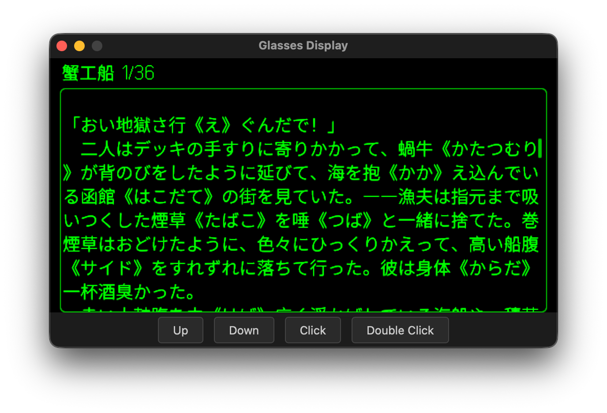
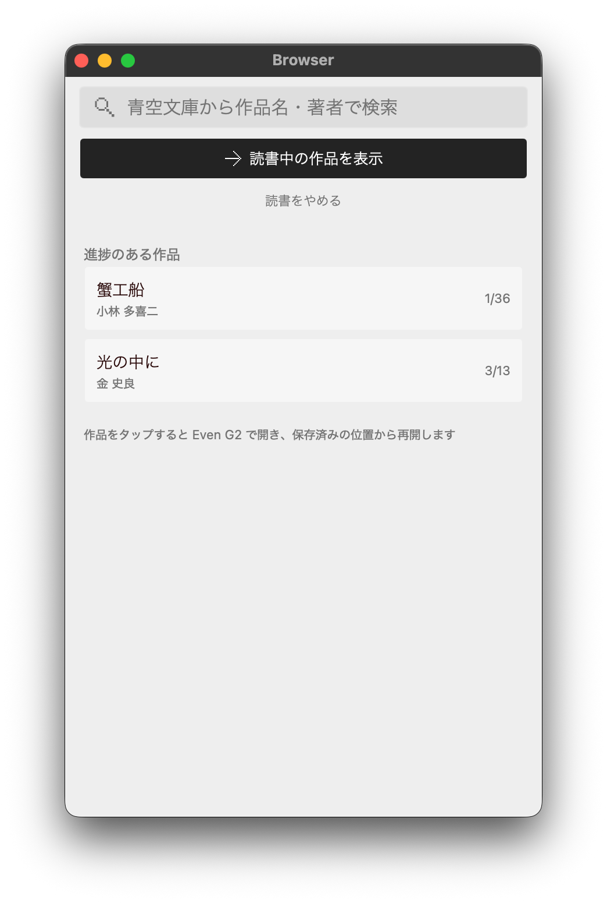
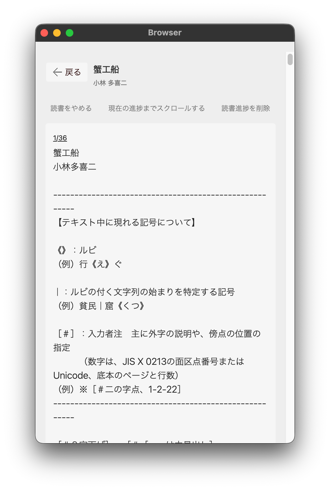
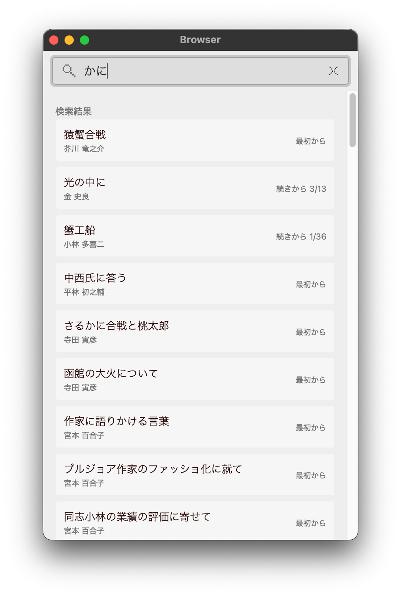

# even-aozora-reader

<p align="center">
  
</p>

## Overview

An Aozora Bunko reader for **Even G2**.

This app lets users search works in a WebView UI, open them on Even G2 glasses, navigate pages with ring gestures, and resume from saved reading progress.

### What is Aozora Bunko?

**Aozora Bunko** is a well-known Japanese digital library of public-domain and rights-cleared literary works.
For English-speaking readers and developers, it can be seen as a Japanese counterpart to Project Gutenberg, with many classic authors and texts available in a structured, reusable format.

Official site: [Aozora Bunko](https://www.aozora.gr.jp/)

### Try it now

Scan the QR code below in the Even Realities app to use this on your Even G2.

<p align="center">
  
</p>

### Screenshots

#### Even


#### WebView

<p align="center">
  
  
  
</p>

### Controls (Ring)

In the reader page:

| Ring action | Behavior |
| --- | --- |
| Scroll up/down | Move within the current page content |
| Click | Move to the next page |
| Double click | Move to the previous page |

## Developer Notes

### Project Context

- This project was built as a hands-on technical study of Even G2 app development.
- Although there are unofficial design libraries, tooling, and SDK-related resources for Even, this app intentionally uses only official libraries to validate and understand the official APIs directly.
- The UI is implemented with shadcn/ui, based on the official Even design guideline in Figma.

### Tech Stack

- **Vite + React + TypeScript**
- **shadcn/ui** for the WebView UI components
- **@evenrealities/even_hub_sdk** for Even device/HUD integration
- **evenhub-cli** for local emulator/dev workflow
- **mise** for tool version management consistency

### System architecture

```text
[G2 glasses] <--BLE--> [Even app / simulator] <--HTTP--> [Proxy Server] <--HTTP--> [Aozora Bunko]
```

`Proxy Server` is an Aozora Bunko **proxy API**.
It provides APIs for Aozora Bunko work search and full-text retrieval.
In this project, no app-specific backend server is required in this repository.
The WebView is embedded in the Even app/simulator and calls the proxy API.

### References

- https://github.com/nickustinov/even-g2-notes/blob/main/G2.md
- https://github.com/BxNxM/even-dev
- https://github.com/nickustinov/weather-even-g2
- https://github.com/fuutott/rdt-even-g2-rddit-client
- [Even Hub App Guideline (Figma)](https://www.figma.com/design/X82y5uJvqMH95jgOfmV34j/Even-Realities---Software-Design-Guidelines--Public-?node-id=10001-74320&t=3TVk6VSECbCRvj0L-0)
- Even Realities official Discord

## Contributing

### Requirements

- `mise`

### Getting Started

#### 1) Trust project configuration

```bash
mise trust
```

#### 2) Install toolchain versions managed by mise

From the project root:

```bash
mise install
```

#### 3) Install dependencies

```bash
pnpm install
```

#### 4) Run development environment

```bash
mise run dev
```

This starts the **Even emulator** and **WebView** together.

### Scripts

- `mise run dev`
  - Starts both the Even emulator and the WebView in one command.
- `mise run production`
  - Displays the production environment in the emulator.
